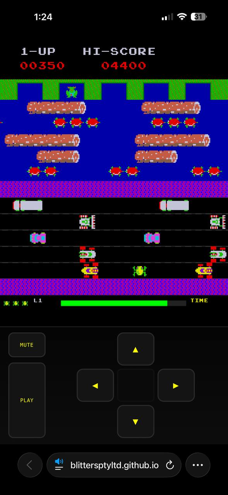

# Frogger — an AI-assisted arcade reconstruction

[](https://github.com/blittersptyltd/grok-frogger/actions/workflows/deploy-pages.yml)

A mobile-first browser reconstruction of the 1981 arcade game, built as an experiment in human-directed, AI-assisted product development.

**[Play the live game](https://blittersptyltd.github.io/grok-frogger/)**



## Why this project exists

The goal was bigger than producing a playable clone. We wanted to test whether an AI coding agent could help take a product from a plain-language brief to a polished, deployable experience while a human supplied the taste, visual judgement and product direction.

The result includes:

- faithful tile-stepped Frogger gameplay
- road, river, homes, scoring, lives and level progression
- diving turtles, crocodiles, snakes, flies and lady-frog bonuses
- a Canvas-rendered cabinet-style attract sequence
- synthesised Web Audio music and sound effects
- keyboard, swipe and on-screen D-pad controls
- an installable mobile PWA
- responsive portrait and landscape layouts
- persisted high scores and fullscreen/install guidance
- automated regression tests and GitHub Pages deployment

This was not a one-prompt exercise. It was an iterative product build involving reference analysis, implementation, browser testing, mobile feedback, rejected shortcuts and repeated visual tuning.

## The AI experiment

The human role focused on:

- defining the product and fidelity target
- comparing builds against arcade references
- identifying visual and interaction problems
- deciding which compromises were acceptable
- steering mobile usability and the final feel

The AI-agent role focused on:

- architecture and implementation
- sprite and Canvas rendering workflows
- collision, timing and responsive geometry
- Web Audio synthesis and lifecycle debugging
- PWA/browser integration
- automated verification, documentation and deployment

A useful lesson was that an agent can implement quickly, but speed is not the same as understanding intent. The attract-mode title initially went through several approximations—including an invalid captured-video shortcut—before being rebuilt correctly as a seven-frog Canvas animation. Human review was the quality system that caught the difference.

Read the full [AI development retrospective](docs/AI-DEVELOPMENT-RETROSPECTIVE.md).

## Technology

- TypeScript
- Canvas 2D
- Web Audio API
- Vite
- Vitest
- static PWA assets and service worker
- GitHub Actions and GitHub Pages

There are no production JavaScript dependencies or backend services.

## Architecture

The game uses a fixed 60 Hz simulation loop rendered through Canvas:

```text
Input ──► Game state machine ──► Frog / lanes / homes / bonuses
                    │
                    ├──► collision, scoring and level progression
                    ├──► Canvas renderer and sprite atlas
                    └──► Web Audio music and effects
```

The logical mobile-first playfield is 448×544 pixels. Gameplay rows can be deeper than their 32 px content tiles, allowing extra mobile breathing room without stretching sprites or separating collision geometry from visuals.

See [Architecture](docs/ARCHITECTURE.md) for the module map and design decisions.

## Controls

| Input | Action |
|---|---|
| Arrow keys / WASD | Hop one tile |
| Swipe on the playfield | Hop in swipe direction |
| On-screen D-pad | Mobile movement |
| Enter / Space / START | Start or continue |
| M / MUTE | Toggle audio |
| FULL | Fullscreen or installation help |
| Backtick (`) | Collision debug overlay |

## Mobile and PWA use

Touch controls appear automatically on coarse-pointer devices and narrow viewports.

For true fullscreen on iPhone:

1. Open the game in Safari.
2. Choose **Share → Add to Home Screen**.
3. Launch Frogger from its home-screen icon.

In-app browsers cannot always hide their own chrome. The game detects those constraints and provides installation guidance rather than pretending fullscreen succeeded.

## Local development

Requires a current Node.js release.

```bash
npm install
npm run dev
```

Open the URL printed by Vite. The project is served beneath `/grok-frogger/` to match GitHub Pages.

### Quality gate

```bash
npm run test   # Vitest regression suite
npm run build  # TypeScript + production bundle
npm run check  # tests + build + dependency audit
```

### Project structure

```text
src/
  main.ts                 boot and browser integration
  fullscreen.ts           fullscreen/install helpers
  install.ts              PWA registration and install flow
  types.ts                shared dimensions, palette and state types
  game/
    Game.ts               fixed-step loop and game-state orchestration
    Attract.ts            pure attract-cycle timing and demo route
    Frog.ts               movement, animation and death states
    Lane.ts               obstacle lane lifecycle
    Obstacle.ts           vehicles, platforms and hazards
    Homes.ts              home seating and occupants
    Bonuses.ts            fly/lady-frog behaviour
    World.ts              row geometry and background rendering
    HUD.ts                arcade-font and HUD rendering
    Audio.ts              Web Audio synthesis and lifecycle
    Levels.ts             progressive feature unlocks
public/
  sprites/cut/            runtime sprite assets
  manifest.webmanifest    installable PWA metadata
docs/
  content/                publication-ready website material
  plans/                  original design records
```

## Development story and tutorials

- [Architecture](docs/ARCHITECTURE.md)
- [AI development retrospective](docs/AI-DEVELOPMENT-RETROSPECTIVE.md)
- [Recreating the cabinet attract sequence](docs/ATTRACT-MODE-RECREATION.md)
- [Mobile and PWA design notes](docs/MOBILE-PWA.md)
- [Website tutorial: build a Canvas arcade game with an AI coding agent](docs/content/tutorial-build-canvas-arcade-game-with-ai.md)
- [Publishing and social kit](docs/content/publishing-kit.md)

## Project status

The project is considered **complete** as an AI-assisted product experiment. Future changes should be treated as optional enhancements rather than unfinished core work.

## Intellectual-property notice

This is an educational, non-commercial fan reconstruction and is not affiliated with or endorsed by Konami. *Frogger*, its characters, visual identity and original arcade material belong to their respective rights holders.

The repository is published to document an AI-assisted development experiment. Do not assume that included game graphics, names or other derivative assets are available for unrestricted reuse. See [NOTICE.md](NOTICE.md).
